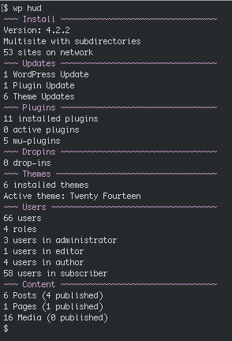

# WP HUD

Shows these stats:

 - Install (version, single/multi)
 - Pending updates
 - Plugins (installed, active, mu)
 - Drop-ins
 - Themes (installed, active)
 - Users (total, per-role)
 - Content (total/published per type). Not shown if multisite

